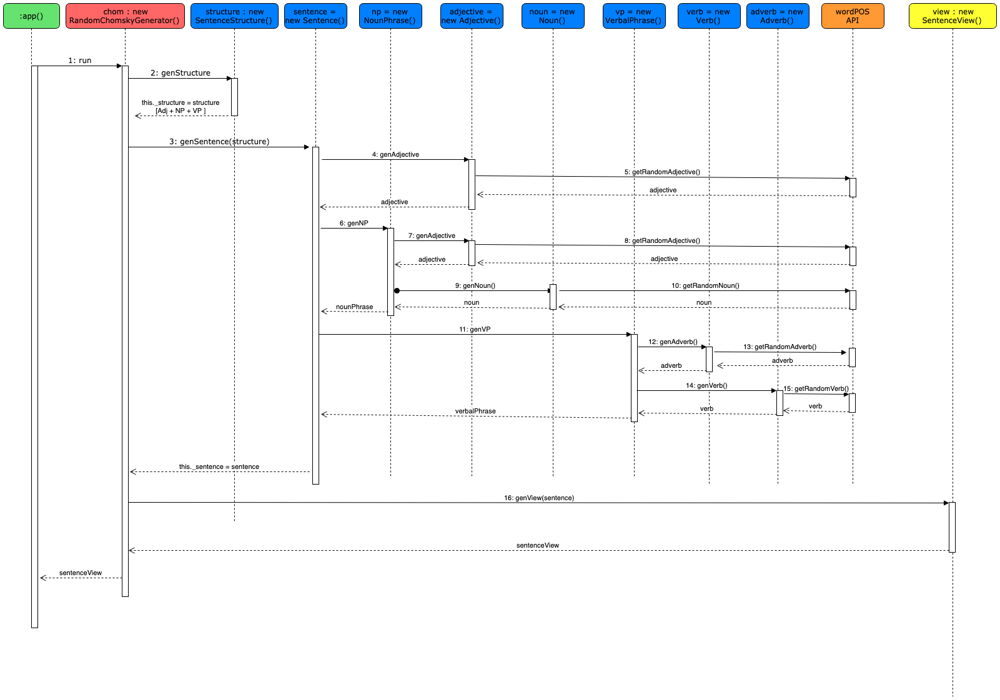

# WELCOME TO YOUR RANDOM CHOMSKY

This project is the second iteration of a personal project that I have developed while studying to become a programmer at Makers Academy. It allows you to generate random sentence structures and also random sentences.

You can visit the working version of this app [here](https://your-random-chomsky.herokuapp.com/)

Inspired by the early works of linguist Noam Chomsky, this project follows these requirements:
  1. Generate random sentence structures
  2. Generate random sentences based on random sentence structures
  3. Resulting sentences have to be both grammatical AND meaningless.

An alternative version of this project, in Ruby, is [here](https://github.com/guilhe0756/random-chomsky-generator).

## How to use

Before you start, please run ```npm install```. You can start the server by running ```npm start``` and then go to ```localhost:8080``` on your browser.

## Requirements

- generates random sentences
- generates random sentence structures
- uses an API to retrieve parts of speech randomly
- sentences are grammatical
- sentences are meaningless

## User stories

```
As a big fan of linguistics
So that I can look at different parts of sentences every day
I would like to be able to generate random nouns
:check:

As a big fan of linguistics
So that I can look at different sentences every day
I would like to be able to generate random adjectives
:check:

As a big fan of linguistics
So that I can look at different sentences every day
I would like to be able to generate random verbs
:check:

As a big fan of linguistics
So that I can look at different sentences every day
I would like to be able to generate random adverbs
:check:

As a big fan of linguistics
So that I can look at different sentences every day
I would like to be able to generate random sentences
:check:

As a big fan of linguistics
So that I can look at different sentences every day
I would like the structures of these random sentences to also be random

As a big fan of linguistics
So that my sentences sound correct
I would like the sentences to be grammatical

As a big fan of linguistics
So that my sentences are puzzling
I would like the sentences to be meaningless
```

## Sequence Diagram

The diagram below shows the flow of calls between different objects of the application. It is a two dimensional diagram based on a Unified Modelling Language (UML) approach to software modelling. The vertical bars show the sequence of messages sent between objects (note the numbers in sequence) while the horizontal arrows show the object instances to which the messages are sent.




## Approach

0. Decide on tech stack:
  - Language: JavaScript
  - Testing framework: Cypress
  - Testing coverage: Istanbul
  - Web framework: Express
  - Web framework testing: Cypress
  - Web driver: geckodriver
  - Linter: Eslint
  - Parts of Speech API: [wordpos](https://www.npmjs.com/package/wordpos) (API)

1. Requirements, user stories and diagram
2. Draft of tests and functions


## Screenshots

### Developed by

@anthrolanguage

London, Sprin '19.

## If you want to know more...

...about the process of creating this program, including some brief reflexions on its dependencies, please have a look at my [blog](https://medium.com/@guilhermexunu)
